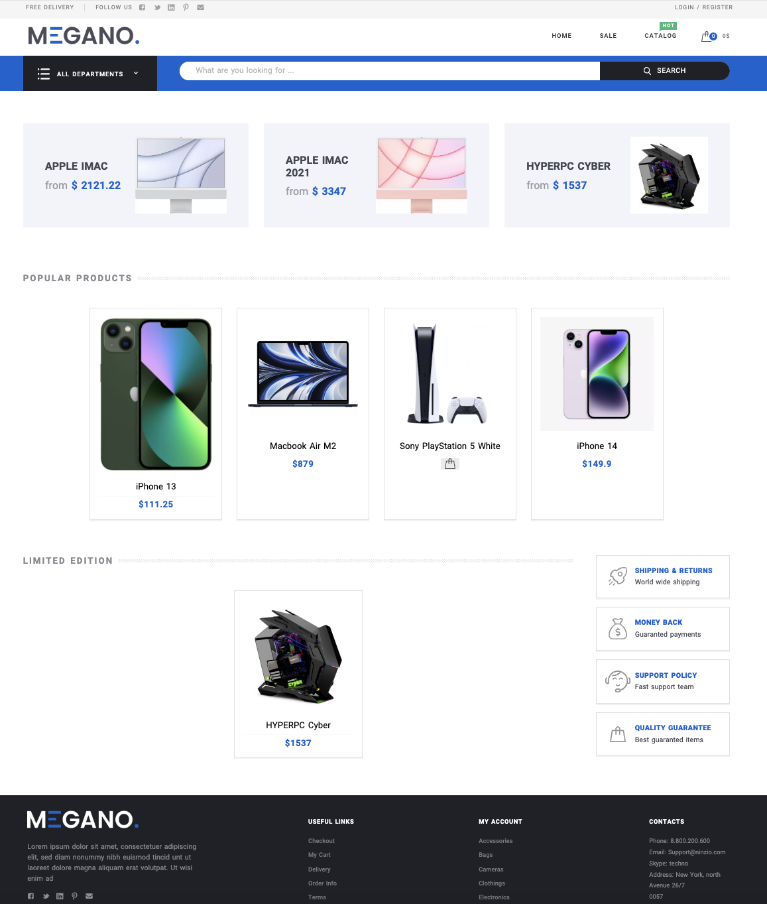

# Интернет-магазин MEGANO 

### Desktop Preview
https://github.com/user-attachments/assets/88f668db-81f7-41f2-9405-e089b3dfc3d6

<h3 align="center">Интернет магазин по продаже техники</h3>
Проект разработан на фреймворке Django. За отображение страниц отвечает приложение frontend, а обращение за данными происходит по API, который реализован с использованием Django Rest Framework.



## Инструкция по запуску проекта

Для установки исходника интернет магазина необходимо ввести следующую команду:

1. Скопировать файлы проекта. Создать и войти в виртуальное окружение.
```commandline
git clone https://gitlab.skillbox.ru/almir_zalitov/python_django_diploma.git
```
2. Установка необходимых зависимостей.
```commandline
pip install -r requirements.txt 

pip install shop_megano/diploma_frontend-0.6.tar.gz
```
3. Создание БД и загрузка фикстур:
```commandline
python manage.py makemigrations - создание миграций

python manage.py migrate - применение миграций.

python manage.py loaddata ./fixtures/*  - установка фикстур
```
4. Запуск сервера.
```commandline
python manage.py runserver - с установленным значением debug True

docker compose up app - запуск из контейнера Docker
```

### Структура сайта. 
В фикстурах созданы `товары`, `заказы`, `пользователи`.

К товарам добавлены тэги, спецификации и отзывы.
У пользователей есть личные профили, а так же их актуальные заказы.

* Пользователи и их роли.

Логин для входа        | Пароль | Группа |
-----------------|-----------------|---------------|
admin  |   123   |   superuser|
user     |   123   |    Покупатель|
oleg2002      |   123   |    Покупатель|
tamaev      |   123   |        Покупатель       |
Andrey      |   123   |      Покупатель|

